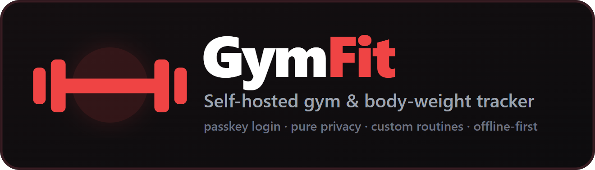
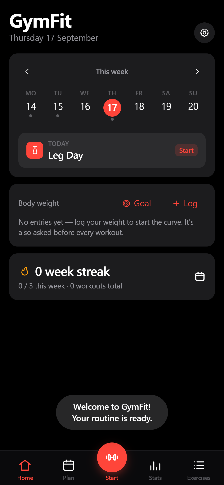
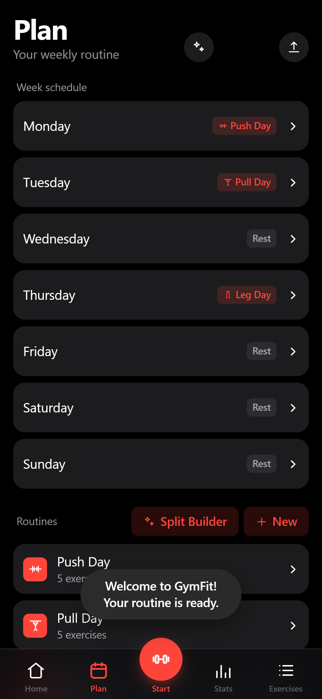
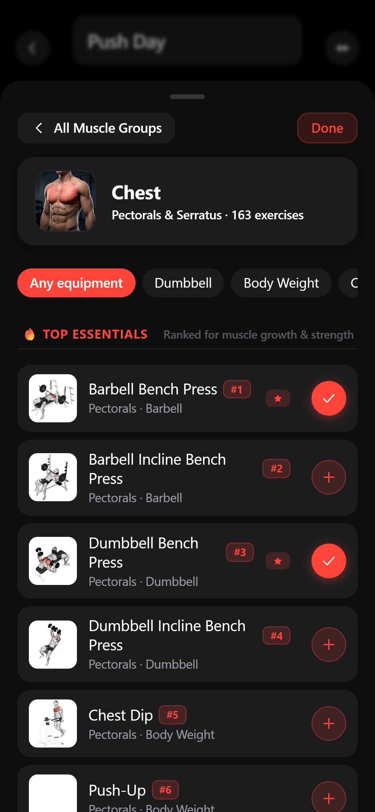
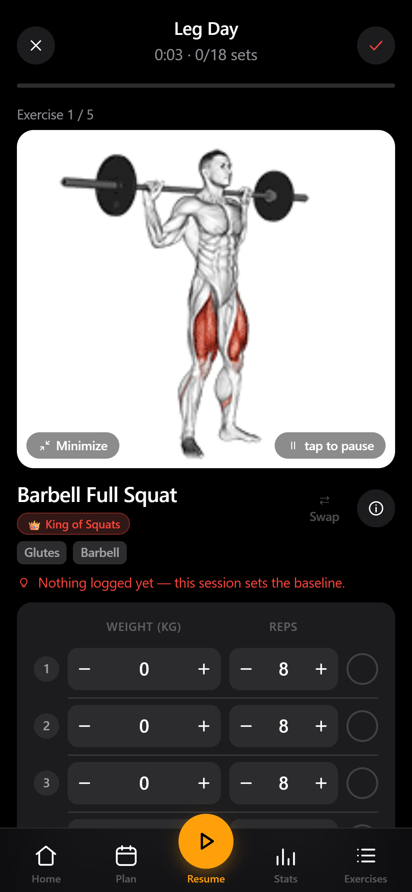
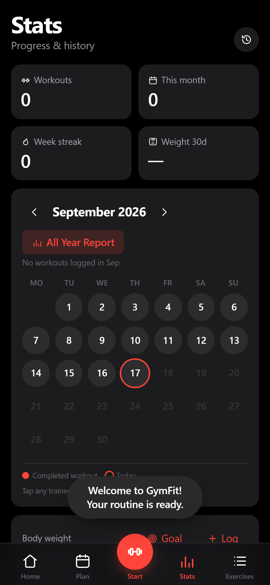
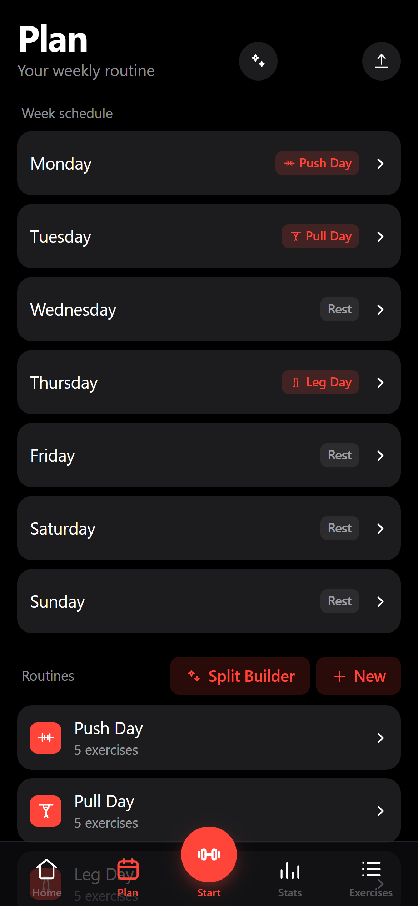

<div align="center">



<br>

**A modern, self-hosted gym & body-weight tracker you actually own.**

Plan your week, run guided workouts, track every set, and monitor your body weight over time —
on your phone, synced across devices, behind your own passkey login.
Default sleek dark & red aesthetic, instant-add routine builder, offline-first, no subscription, no ads. Just `docker compose up`.

<br>


<br>

[](https://github.com/xtremLYx/GymFit/stargazers)
[](https://github.com/xtremLYx/GymFit/issues)

</div>

<br>

> ### 🤖 Includes Optional AI Coach
>
> An integrated AI assistant that **designs** your training plan and **revises it from what you
> actually log**, running on your own server under your own provider account.
>
> With the Coach switched off, the app runs completely standalone and private.
>
> **→ [What it does and how to use it](docs/AI_COACH.md)** ·
> [Claude setup](Claude-setup-instructions.md) ·
> [ChatGPT / Codex setup](ChatGPT-setup-instructions.md) ·
> [Design deck (PDF)](openGym_AI_Strategy.pdf)

<br>

<div align="center">
<table>
<tr>
<td align="center" width="33%"><br><sub><b>Home Dashboard</b><br>Today's plan, body weight & streak</sub></td>
<td align="center" width="33%"><br><sub><b>Weekly Plan</b><br>Schedule, split builder & routines</sub></td>
<td align="center" width="33%"><br><sub><b>Exercise Picker</b><br>1,300+ exercises with instant <code>+</code> add</sub></td>
</tr>
<tr>
<td align="center" width="33%"><br><sub><b>Guided Workout</b><br>Live sets, timers & animated form demos</sub></td>
<td align="center" width="33%"><br><sub><b>Stats & Calendar</b><br>Activity heatmap, history & PR tracking</sub></td>
<td align="center" width="33%"><br><sub><b>Exercise Library</b><br>Filter by equipment & target muscle</sub></td>
</tr>
</table>
</div>

<br>

## Why GymFit?

Most fitness apps lock your data behind recurring monthly subscriptions, force account creation on proprietary servers, nag you with ads, or disappear when the company shuts down. 

**GymFit is the opposite:**
- **You own your data** — Everything lives on your own machine in simple JSON files.
- **Biometric passkeys** — Login with Face ID, Touch ID, or fingerprint without storing passwords.
- **Offline-first PWA** — Install directly to your home screen; runs with zero signal in the gym.
- **High-performance UI** — Fast, fluid, modern dark mode with vivid red accents tailored for AMOLED displays.

## Features

- 🔴 **Vibrant Red & Dark Aesthetic** — Engineered for focus in low-light gym environments with 8 switchable accent themes.
- ⚡ **Instant-Add Exercise Picker** — Dedicated `+` quick-add button on every exercise card to instantly build routines without redundant roundtrips.
- 🏋️ **Weekly Plan & Split Builder** — Create customized PPL, Arnold, or Upper/Lower splits with an interactive muscle-coverage heatmap.
- ⚖️ **Body-Weight Tracking** — Interactive weight curve with goal target lines and trend calculations.
- 🗓️ **Flexible Rescheduling** — Missed a workout or swapping rest days? Shift sessions across weekdays without disrupting your baseline routine.
- ▶️ **Guided Workouts** — Pre-fills prior weights, offers rest timers, PR detection, and persistent screen wake-lock so your phone never sleeps mid-set.
- 🔗 **Supersets & Timed Sets** — Group paired movements and run countdown timers for planks, hangs, and wall sits.
- 📈 **Smart Progression Rules** — Linear progression, Greyskull LP (AMRAP top set), double progression, or time targets with automatic deload handling.
- 💪 **Estimated 1RM Tracking** — Calculates and graphs 1-rep max benchmarks from your highest eligible lifts.
- 🎯 **Effort per Set (RIR & RPE)** — Optional rate-of-perceived-exertion logging to track proximity to failure.
- 🏃 **Cardio & Custom Movements** — Track time and distance for cardio, or define your own custom exercises with notes.
- 🟩 **Activity Heatmap & Muscle Map** — GitHub-style yearly training consistency grid and anatomical muscle recovery map.
- 🔔 **Push Notifications & Reminders** — Background rest timer buzzers and gentle reminders for planned gym days.
- 🤖 **AI Coach (Optional)** — Server-side autonomous planning agent compatible with Claude or OpenAI Codex.
- 🔑 **Passkey Authentication** — Native WebAuthn passkey login across devices.
- 📦 **Zero Lock-In** — One-click JSON backup/restore, plus importer support for **Hevy**, **Strong**, **FitNotes**, and **Apple Health**.

## Quick Start (Self-Host with Docker)

Requires [Docker](https://docs.docker.com/get-docker/) with Compose installed.

```bash
git clone https://github.com/xtremLYx/GymFit.git
cd GymFit
cp .env.example .env
docker compose up -d --build
```

Open **http://localhost:8080**, tap **Create profile**, and you're ready to train.

> **Tip:** To enable biometric passkeys from your mobile device across your local network or the internet, set your domain in `.env` (requires HTTPS). See **[docs/SELF_HOSTING.md](docs/SELF_HOSTING.md)**.

## Architecture

```
┌─────────────┐        ┌──────────────────────────────┐
│  Your phone │──HTTPS─▶│  web  (nginx)                │
│  / laptop   │        │   ├─ serves the built app    │
│  (PWA / app)│        │   └─ proxies /api ──────────┐│
└─────────────┘        └──────────────────────────────┘│
                                                        ▼
                                         ┌──────────────────────────┐
                                         │  api  (Node + WebAuthn)  │
                                         │   └─ ./data (JSON files) │
                                         └──────────────────────────┘
```

- **frontend/** — React 19 + Vite, Zustand state management, vanilla CSS tokens.
- **api/** — Lightweight Node backend with `@simplewebauthn/server` for passkeys.
- **web/** — Production multi-stage Nginx container serving optimized static assets.
- **data/** — All state, user profiles, and workout history stored in clear JSON files.

## Configuration

Customizable via `.env`:

| Variable      | Description                                           | Default                 |
|---------------|-------------------------------------------------------|-------------------------|
| `RP_ID`       | Hostname passkeys are bound to                       | `localhost`             |
| `ORIGIN`      | Full URL where the web app is served                  | `http://localhost:8080` |
| `WEB_PORT`    | Host port for the web interface                       | `8080`                  |
| `RP_NAME`     | Display name shown in the passkey prompt              | `GymFit`                |
| `ADMIN_UIDS`  | Comma-separated user IDs with admin access            | *(none)*                |
| `INVITE_ONLY` | Require an invite token to create new profiles        | `false`                 |
| `COACH_DISABLED` | Force AI Coach disabled instance-wide              | *(unset)*               |

## Contributing & Community

- **Issues & Feature Requests**: [GitHub Issues](https://github.com/xtremLYx/GymFit/issues)
- **Pull Requests**: Contributions, bug fixes, and translation additions are welcome!

## License

Copyright © 2026 xtremLYx. All rights reserved.

This repository and its codebase are private and proprietary. Unauthorized copying, modification, distribution, or commercial use is strictly prohibited.

Exercise image and animation assets are curated from public datasets and maintain their respective notices (see [NOTICE.md](NOTICE.md)).
